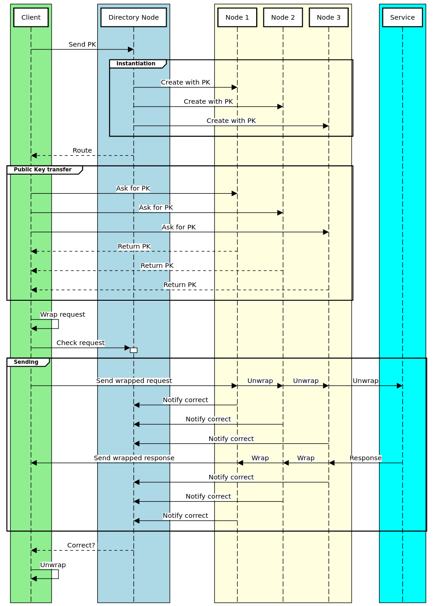

# Onion Router

A Docker based anonymity solution that implements basic functionalities of onion routing and can be deployed in GCloud.

Written as part of the Advanced Internet Computing Lab, SoSe 2022, held at [TUHH](https://www.tuhh.de/ide/homepage.html).

A Go version of this onion router which runs only locally (and has slightly different directory node communication) can be found [here](https://github.com/MichelKrispin/GoOnionRouter).

## Overview

- Get the project up and running -> [Look here](#up-and-running)
- Functionality description -> [Look here](#functionality-description)
- Building manually -> [Look here](#building-manually)

## Up and Running

Getting the project into the Google Cloud as soon as possible.

Please read the complete _Up and Running_ chapter before running anything.

### Prerequisites

- Docker
  - If you have to use Docker with `sudo`: To push images to GCloud on Linux you need `sudo usermod -a -G docker ${USER}` and then reboot (as described [here](https://cloud.google.com/artifact-registry/docs/docker/authentication#gcloud-helper)). You can afterwards remove it again with `sudo usermod -r -G docker ${USER}`.
- Google Cloud CLI (gcloud)
  - Logged in with `gcloud auth login`
  - An existing project (can be seen with `gcloud projects list`)
- python3

(Note that some parts still depend on the region 'europe-west3'. Please use it.)

### Starting

**Important: On the clients web interface you have to manually insert the directory node and service URL.**

There are two possibilities.
The first one is a more transparent approach (as the script might at some point need super user permission).

If you know the name of your project and its fine to build the Docker container locally, then try the first approach:

```sh
./generate_build_script.py # or: python3 generate_build_script.py
sh build.sh # Or run the listed commands from this script one after another
```

The second one tries to automate more but expects you to have already set a default project with `gcloud config set project <project-id>`:

```sh
./build.py # or: python3 build.py
```

The manual stepy by step instructions can be found [here](#building-manually).

**There might be an error such as `'private.pem' not found`, then reload the client website (Ctrl+Shift+R). A new key pair will be created then if there doesn't exist one.**

### Stopping

The following scripts asks gcloud for all services that are still running in `europe-west3` and stops them.

```sh
./stop_services.sh
```

Otherwise delete the complete project, delete all services in the GCloud console or run the following line for each service. (Such as `directory`, `service`, `client` etc...)

```sh
gcloud run services delete <service> -q --region europe-west3
```

## Functionality Description

The project is build out of a Directory Node, Intermediate Node, an Originater (or Client) and some Service.

The Directory Node controls the Intermediate Nodes and instantiates them.

The Intermediate Nodes pass on and unwrap the received package and wrap them up on the way back.

The Client just wants to pass some HTTP request anonymously to some Service.
It asks the Directory Node for a route of nodes, asks each node for their public RSA key and wraps then the HTTP request up in an anonymous package.

For detailed information have a look at this diagram:


### GCloud

GCloud is used in the following way:

1. The Artifact Registry stores the Docker images
2. The Run API starts stateless container from the Artifact Registry images
3. When initiated with a route request, the Directory node instantiates three nodes by using the gcloud cli itself. The three requests are issued asynchronously to speed up the process.

## Building manually

Should only be considered if the `build.py` script is not used.

Replace the following tags:

- `<project>` 🠒 Individual Google Cloud project.
- `<repo>` 🠒 The repository name of the GCloud Artifact Registry repository.
- `<location>` 🠒 Preferred region/location (`europe-west3` is Frankfurt).

### Prerequisites

For the GCloud APIs and such have a look at the next subsection.

- Docker
  - If you have to use Docker with `sudo`: To push images to GCloud on Linux you need `sudo usermod -a -G docker ${USER}` and then reboot (as described [here](https://cloud.google.com/artifact-registry/docs/docker/authentication#gcloud-helper)). You can afterwards remove it again with `sudo usermod -r -G docker ${USER}`.
- Google Cloud CLI (gcloud)
  - Logged in with `gcloud auth login`
  - An existing project

#### GCloud Prequisites

Set up Google Cloud such that every needed service is enabled.

Note that a project has to exist in GCloud already.

```
# Figuring out which projects exist
gcloud projects list

# Set the active project that will be used
gcloud config set project <project>

# Enable Artifact Registry and Cloud Run
gcloud services enable artifactregistry.googleapis.com
gcloud services enable run.googleapis.com

# Create a repository in the Artifact Registry
gcloud artifacts repositories create <repo> \
    --repository-format=docker \
    --location=<location>

# Add the artifact registry to docker push
gcloud auth configure-docker <location>-docker.pkg.dev

# Create a new IAM role so that the Directory Node can instantiate nodes
gcloud iam roles create hello \
    --project <project> \
    --title "Directory Node Permission" \
    --description "This role has only the run.services.setIamPolicy permission" \
    --permissions run.services.setIamPolicy
MEMBER=serviceAccount:$(gcloud projects describe <project> --format="value(projectNumber)")-compute@developer.gserviceaccount.com
gcloud projects add-iam-policy-binding <project> \
      --member=$MEMBER \
      --role='projects/<project>/roles/hello'
```

### Docker

The Docker images are also on Docker Hub.
For development purposes they were rebuilt locally anyway and it shouldn't take too long so its also fine to build them.

After having the local images, they have to be tagged so that they can be uploaded to the GCloud Artifact Registry.

**Note: You might have to prepend `sudo` in front of all docker commands.**

#### Pulling Docker Images

Pulling all images from Docker Hub.

```sh
# Directory Node
docker pull michelkrispin/directory
docker tag michelkrispin/directory <location>-docker.pkg.dev/<project>/<repo>/directory
docker push <location>-docker.pkg.dev/<project>/<repo>/directory

# Intermediate Node
docker pull michelkrispin/node
docker tag michelkrispin/node <location>-docker.pkg.dev/<project>/<repo>/node
docker push <location>-docker.pkg.dev/<project>/<repo>/node

# Service
docker pull michelkrispin/service
docker tag michelkrispin/service <location>-docker.pkg.dev/<project>/<repo>/service
docker push <location>-docker.pkg.dev/<project>/<repo>/service

# Originator/Client
docker pull michelkrispin/client
docker tag michelkrispin/client <location>-docker.pkg.dev/<project>/<repo>/client
docker push <location>-docker.pkg.dev/<project>/<repo>/client
```

#### Building Docker Images

Or building them all locally.

```sh
# Directory Node
docker build -t directory ./DirectoryNode
docker tag directory <location>-docker.pkg.dev/<project>/<repo>/directory
docker push <location>-docker.pkg.dev/<project>/<repo>/directory

# Intermediate Node
docker build -t node ./IntermediateNode
docker tag node <location>-docker.pkg.dev/<project>/<repo>/node
docker push <location>-docker.pkg.dev/<project>/<repo>/node

# Service
docker build -t service ./Service
docker tag service <location>-docker.pkg.dev/<project>/<repo>/service
docker push <location>-docker.pkg.dev/<project>/<repo>/service

# Originator/Client
docker build -t client ./Originator
docker tag client <location>-docker.pkg.dev/<project>/<repo>/client
docker push <location>-docker.pkg.dev/<project>/<repo>/client
```

### Deploying to GCloud

The output of these contain the URLs of the services.

```sh
gcloud run deploy service --region <location> --allow-unauthenticated --image <location>-docker.pkg.dev/<project>/<repo>/service
gcloud run deploy directory --region <location> --allow-unauthenticated --image <location>-docker.pkg.dev/<project>/<repo>/directory
gcloud run deploy client --region <location> --allow-unauthenticated --image <location>-docker.pkg.dev/<project>/<repo>/client
```

### Stopping the container

For stopping the container have a look [here](#stopping).
